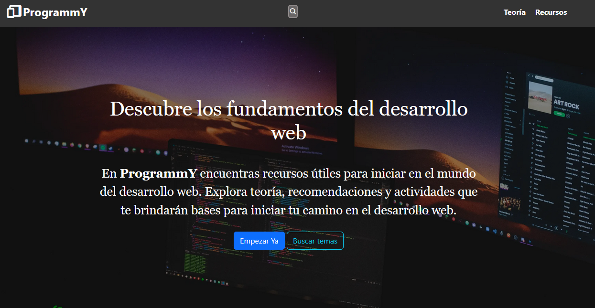

# ProgrammY: Proyecto frontend vanilla.

Este es un sitio web desarrollado con HTML, CSS y JavaScript vanilla. El sitio esta pensado para ser utilizado de manera didáctica para estudiar algúnos conceptos básicos del desarollo web.

## Características:

* Diseño responsive con HTML, CSS y JavaScript vanilla.
* Creación de íconos animados utilizando librerías externas.
* Creación de listas desplegables con JavaScript.
* Generación de juegos y actividades didácticas a través de JavaScript.
* Generación dinámica de bloques de código HTML con JavaScript.
* Uso del framework Bootstrap para estilizar algunos elementos.
* Uso de la API Stack Exchange - API V2.3.

_________________________________________

## Screenshot

[Demo version](https://programmy.netlify.app)
